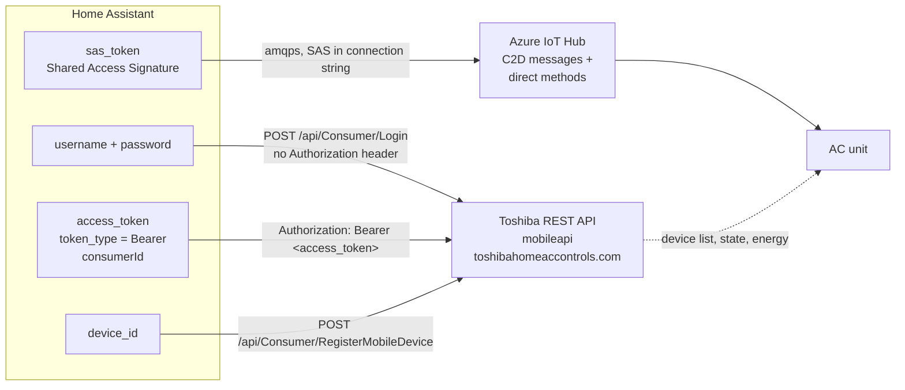
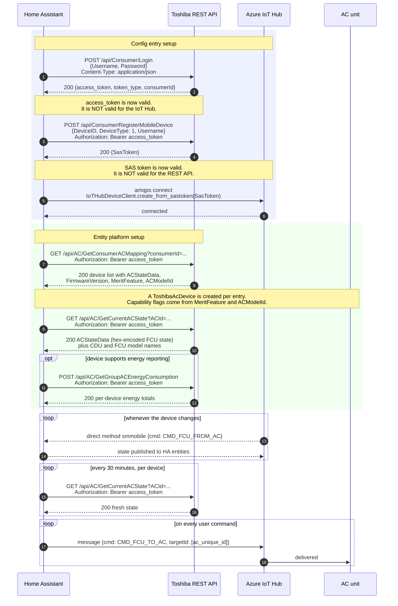

# Authentication

How this integration authenticates against Toshiba's servers, which credential
travels to which endpoint, and which feature uses which transport.

Two independent credentials are involved. They are obtained in sequence, from
two different services, and each is only valid for one of them.

## Credentials at a glance

| Credential | Type | Obtained from | Sent to | Protects |
|------------|------|---------------|---------|----------|
| Username + password | user input | — | `POST /api/Consumer/Login` (request body) | Nothing on its own |
| Access token | Opaque bearer token | `POST /api/Consumer/Login` | Every HTTPS call to `mobileapi.toshibahomeaccontrols.com` | REST API reads |
| SAS token | Shared Access Signature | `POST /api/Consumer/RegisterMobileDevice` | Azure IoT Hub (AMQP) | Live device link, all commands |

The access token and the SAS token are **not** interchangeable. The access token
never leaves the HTTPS host, and the SAS token is only ever used by the Azure
IoT Hub client.

Note that commands never travel over HTTPS. Every write to the device goes out
through the IoT Hub link.

## Bootstrap sequence

The first three requests are part of config entry setup. The last three happen
afterwards, when the entity platforms are set up. That split matters for error
handling, see [below](#three-setup-phases-three-different-failure-behaviours).

The connection steps are bounded by a 30-second timeout, so a hanging IoT Hub
connection cannot block Home Assistant startup.

## Endpoints

| Endpoint | Method | Bearer token | Purpose | Called |
|----------|--------|--------------|---------|--------|
| `/api/Consumer/Login` | POST | no | Exchange credentials for access token, get `consumerId` | Once per setup |
| `/api/Consumer/RegisterMobileDevice` | POST | yes | Register this Home Assistant instance, obtain SAS token | On first setup and on SAS renewal |
| `/api/AC/GetConsumerACMapping` | GET | yes | List AC units and their capabilities | Once per setup |
| `/api/AC/GetCurrentACState` | GET | yes | Full device state, plus CDU/FCU model names | Once per setup, then every 30 min |
| `/api/AC/GetGroupACEnergyConsumption` | POST | yes | Energy totals per device | Every 10 min, only if supported |

All HTTPS requests carry a browser `User-Agent`. This integration additionally
patches the request session to send a `Device-ID` header, which Toshiba's web
application firewall requires in order to distinguish installations. Without it
the gateway answers `429 Too Many Requests` and the integration cannot set up at
all.

## Transport per feature

This is the part that matters when diagnosing behaviour: **every control is
written over AMQP, only reads use HTTPS.**

| Entity | Platform | Read from | Written to |
|--------|----------|-----------|-------------|
| HVAC mode, power | `climate` | AMQP push | AMQP `set_ac_status` / `set_ac_mode` |
| Target temperature | `climate` | AMQP push | AMQP `set_ac_temperature` |
| Fan speed | `climate` (via `set_fan_mode`) | AMQP push | AMQP `set_ac_fan_mode` |
| Swing | `climate` (via `set_swing_mode`) | AMQP push | AMQP `set_ac_swing_mode` |
| CDU silent, fireplace | `select` | AMQP push | AMQP via entity description (`ac_merit_a` / `ac_merit_b`) |
| 8 degree heating, air purifier, eco mode, high power | `switch` | AMQP push | AMQP via entity description (`ac_merit_a` / `ac_merit_b` / `ac_air_pure_ion`) |
| Outdoor temperature | `sensor` | AMQP push | — |
| Power consumption | `sensor` | REST every 10 min | — |

Read the two columns together. Every entity reads its current value from an AMQP
push, and only the power consumption sensor is refreshed over HTTPS. No setting
is ever written over HTTPS — all writes go out as AMQP messages.

Outbound commands are published as AMQP messages with the payload
`{"cmd": "CMD_FCU_TO_AC", "targetId": [<ac_unique_id>], ...}`. The device state
itself travels as a hex-encoded string inside that payload.

Inbound, Toshiba calls a direct method named `smmobile` on the IoT Hub link.
Two commands are handled:

| Inbound command | Meaning |
|-----------------|---------|
| `CMD_FCU_FROM_AC` | New device state |
| `CMD_HEARTBEAT` | Keep-alive |

Any other command name is ignored with an info-level log line.

## Token lifetime

The SAS token carries its own expiry and stays valid until then. Before it runs
out, the Azure client signals `on_new_sastoken_required`, which makes the
integration call `RegisterMobileDevice` again and hand the fresh token back. No
user interaction and no Home Assistant restart is involved.

Toshiba issues SAS tokens with an expiry roughly a century out, so that proactive
path never fires in practice. The integration therefore also has to recover from a
token that IoT Hub no longer accepts, which is what the next section covers.

The SAS token is stored in the config entry. On setup the device manager is handed
that token and **skips** `RegisterMobileDevice` entirely. Two things can invalidate
it in between, and both are handled before anything is sent to IoT Hub:

* the stored token is already expired, or expires within the renewal margin — the
  token is dropped and a new one is registered
* IoT Hub rejects the token during connect — the same happens, the integration
  makes exactly one re-registration attempt before giving up

Only token-specific errors trigger that second attempt. Network and cloud errors
are retried by Home Assistant as before, because each attempt would otherwise mean
another login against the rate-limited Toshiba API.

The access token is not refreshed on a schedule. It is obtained once per
bootstrap run and lives for the lifetime of the HTTP session. When the session
is torn down and set up again — a Home Assistant restart, a reload, or the
`toshiba_ac.reconnect` service — the whole bootstrap runs again and a fresh
access token is fetched.

## Three setup phases, three different failure behaviours

Where a request fails decides how the failure is reported. The phases are not
handled the same way, and the difference explains most confusing bug reports.

**Phase 1 — config flow.** Validating credentials while the user is still on the
setup form. The library raises a dedicated exception type when the login
endpoint reports `InvalidUserNameorPassword`, and a different one for every other
transport error. This phase has reliable auth detection: a wrong password shows
"Invalid authentication" on the form.

**Phase 2 — config entry setup.** Connecting when Home Assistant starts or
reloads the integration. Token-specific errors first trigger one attempt to
register a new SAS token; if that fails too, the error is classified by searching
the message text for `401`, `403` or `auth`. A match raises a reauth error,
everything else is retried with exponential backoff. The connect is wrapped in a
30 second timeout, since the upstream AMQP connect has none.

A refusal that survives a freshly registered SAS token is not a credential
problem, and the integration says so instead of implying a wrong password. See
[`codebase-architecture.md`](codebase-architecture.md#one-connection-per-account).

**Phase 3 — platform setup.** Fetching the device list and initial state. These
requests happen *after* phase 2 succeeded and are **not** covered by the
classification in phase 2.

| Phase | Failing request | Reported as | Reauth offered |
|-------|-----------------|-------------|----------------|
| 1 | Login, wrong password | Form error "Invalid authentication" | n/a, still on the form |
| 1 | IoT Hub connect fails | Form error "Cannot connect" | no |
| 2 | Login or device registration fails | Retried with backoff | no |
| 2 | Stored SAS token expired or rejected | One new registration attempt, then backoff | no |
| 2 | Any error whose message contains `401`, `403` or `auth` | Reauth error | no (no reauth flow implemented) |
| 3 | Device mapping returns `403` | Platform setup fails, entities unavailable | **no** |
| 3 | Initial state read returns `403` | Platform setup fails, entities unavailable | **no** |

The phase 3 rows are the important ones. A `403` on the device list or the state
endpoint arrives after authentication has already succeeded, so the credential
was accepted and re-authenticating cannot help. The integration does not treat
these as auth errors at all.
