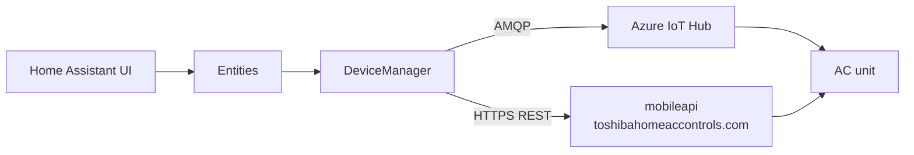

# Architecture

How the Toshiba AC integration talks to Toshiba.

## Entity platforms

| Platform | Entities |
|----------|----------|
| `climate` | Thermostat: HVAC mode, temperature, fan mode, swing |
| `select` | Merit features, fan speed, swing mode |
| `sensor` | Indoor temperature, outdoor temperature, energy consumption |
| `switch` | Self-cleaning, indoor display |

Entities are created per device and only for features the model actually
supports. A device without energy monitoring gets no energy sensor.

## Transports

The integration uses two independent transports against Toshiba's cloud:

| Transport | Purpose | Direction |
|-----------|---------|-----------|
| HTTPS REST | Authentication, device list, full device state | Request/response |
| Azure IoT Hub (AMQP) | Live push updates, command delivery | Bidirectional |

REST is the source of truth at startup. AMQP takes over once connected and
pushes state changes. REST polling re-syncs periodically.

## Component files

| File | Role |
|------|------|
| `__init__.py` | Config entry setup, platform registration |
| `config_flow.py` | Credential entry and validation |
| `const.py` | State, mode and feature mappings |
| `climate.py` | Climate entity |
| `sensor.py` | Sensor entities |
| `select.py` | Select entities |
| `switch.py` | Switch entities |
| `entity.py` | Shared base entity |
| `feature_list.py` | Per-model capability definitions |
| `diagnostics.py` | Troubleshooting download |

All cloud communication lives in the external `toshiba-ac` library, not in this
repository. See [`authentication.md`](authentication.md) for the token and
credential flow.

## One connection per account

The cloud allows exactly **one** active command connection per Toshiba account.
A second client — another Home Assistant instance, or the Toshiba app — takes the
slot and the loser is refused by the message broker. The refusal arrives as
`Credentials invalid, could not connect`, which reads like a wrong password but
is not one.

The integration therefore translates that error into a message that names the
real cause, and raises a persistent notification while it lasts. Rejected
connection behaviour:

| Situation | What the user sees |
|-----------|-------------------|
| A command is sent over a refused connection | Service call fails with a message naming the second instance and pointing at `toshiba_ac.reconnect` |
| Setup registers a fresh SAS token and the broker still refuses | The same message, plus a persistent notification |
| Setup succeeds again | The notification is dismissed |

Two instances on one account cannot be prevented from the integration — the
limitation is in the cloud service. It can only be made visible, so a second
Home Assistant on the same account needs its own Toshiba account.

## Entity availability

Availability is not a property of the cloud connection alone. Two things decide
whether an entity carries a value:

* **Power state of the unit.** Outdoor temperature, indoor temperature and all
  mode switches are filled from the state the unit pushes on its own. An air
  conditioner that is switched off sends nothing, so those entities stay
  unavailable until it is switched on. Only the climate entity itself is
  populated right after setup, because that part comes from the registration
  response.
* **Model capabilities.** Whether fireplace mode, 8 °C heating, eco, high
  power and similar features exist at all depends on the unit. A unit without
  the hardware never reports them, and the corresponding entities are not
  created. See `feature_list.py` for the per-model definitions.

This means an entity being unavailable shortly after setup is expected and not a
sign of a broken connection.

## Error handling

Setup failures are reported to Home Assistant so it can act on them:

| Condition | Result |
|-----------|--------|
| Network error, timeout, cloud unavailable | Setup retry with exponential backoff |
| Error message containing `401`, `403` or `auth` | Reauth error, but no reauth step exists — see [`authentication.md`](authentication.md#three-setup-phases-three-different-failure-behaviours) |

`connect()` is bounded by a 30-second timeout, so a hanging Azure IoT Hub
connection cannot block Home Assistant startup.

## Reporting problems

Include the diagnostics download from the integration page. It contains the
configured entities and device state with credentials redacted.